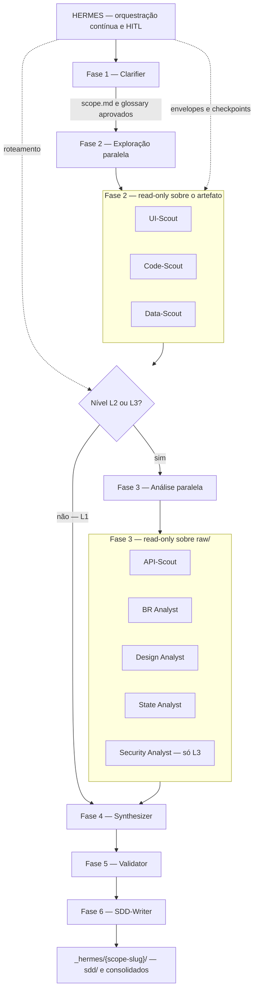

# HERMES — Hierarchical Engineering Reverse-Map & Extraction Squad

HERMES é uma squad agentic do Code Steer para engenharia reversa de artefatos de software e geração de SDDs rastreáveis.

- Site do Code Steer: [codesteer.vercel.app](https://codesteer.vercel.app)


## Visão geral

A HERMES não é um produto separado do ecossistema. Ela é uma squad do Code Steer especializada em engenharia reversa e documentação técnica rastreável.

O projeto segue quatro invariantes centrais:

- Zero inferência: quando falta evidência, a saída correta é pergunta estruturada ou pendência explícita.
- Não modifica o artefato analisado: toda saída vai para `_hermes/{scope-slug}/`.
- Fonte canônica única: agentes, skills, contratos e templates vivem em `_codesteer-hermes/`.
- Sessões isoladas: cada análise mantém seus próprios artefatos e memória auditável.


## Como usar hoje

### Instalação via `npx`

Pré-requisitos:

- Node.js 18+
- Python 3

Instalação interativa com multi-seleção de IDEs:

```bash
npx codesteer-hermes install
```

Instalação não interativa:

```bash
npx codesteer-hermes install --ides codex,cursor --yes
```

Atualização da instalação existente:

```bash
npx codesteer-hermes@latest update
```

Remoção apenas dos arquivos gerenciados pelo pacote:

```bash
npx codesteer-hermes remove --yes
```

Validação da instalação:

```bash
npx codesteer-hermes validate
```

Depois do `install`, abra o agente orquestrador **HERMES** na sua IDE (nome varia por plataforma). Onde o deploy configurar comando slash, use **`/hermes-start`** para uma nova sessão. O fluxo segue as fases da squad com checkpoints HITL entre elas.

## Workflow da squad

O **HERMES** (supervisor) conduz a sessão do intake ao pacote SDD. Nas fases 2 e 3, os workers rodam em *fan-out* paralelo e somente em modo leitura; síntese, validação e escrita do SDD são sequenciais. Em **L1**, após a exploração o grafo segue direto para o **Synthesizer** (sem os workers de análise da fase 3). Em **L2** entram API-Scout, BR Analyst, Design Analyst e State Analyst; em **L3** entra também **Security Analyst**.



## Como utilizar

Uso recomendado da HERMES como squad do Code Steer:

1. Defina o alvo da análise.
   Pode ser `app`, `module`, `screen`, `api` ou `flow`.

2. Defina o nível de detalhe.
   Use `L1` para visão macro, `L2` para visão funcional e `L3` para documentação completa.

3. Garanta o acesso ao artefato.
   O fluxo pode partir de código-fonte, URL, APK/IPA ou combinação, conforme o escopo.

4. Rode a sessão pela IDE com os subagentes HERMES instalados via `npx codesteer-hermes`.
   O agente **HERMES** conduz intake, exploração, análise, síntese, validação e geração do pacote final.

5. Revise os checkpoints HITL ao fim de cada fase.
   A progressão correta da squad depende de aprovação explícita do usuário.

6. Consulte os artefatos gerados em `_hermes/{scope-slug}/`.
   Ali ficam `scope.md`, `session.yaml`, `raw/`, artefatos consolidados, `validation-report.md` e o pacote final `sdd/`.

Exemplo de uso esperado:

- alvo: `módulo de autenticação`
- nível: `L2`
- fonte: `código-fonte no repositório`
- saída: `_hermes/module-user-auth-YYYYMMDD/`

## Artefatos por sessão

Cada sessão deve gravar apenas em `_hermes/{scope-slug}/`.

Estrutura esperada em alto nível:

- `scope.md`
- `glossary.md`
- `session.yaml`
- `raw/`
- artefatos consolidados na raiz
- `validation-report.md`
- `user-confirmation.md`
- `sdd/`

## Licença

Veja o arquivo [LICENSE](LICENSE) na raiz do repositório.
