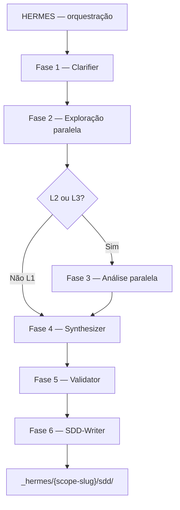

# Code Steer - HERMES

**HERMES** (Hierarchical Engineering Reverse-Map & Extraction Squad) é uma squad agentic do [Code Steer](https://codesteer.vercel.app) para engenharia reversa de software e geração de **SDDs** (Software Design Documents) rastreáveis.

Este repositório contém o **pacote npm** (`npx codesteer-hermes`) e a **fonte canônica** da squad em `_codesteer-hermes/`.

---

## O que é a HERMES

- **Zero inferência:** lacunas viram perguntas ou pendências explícitas — sem suposição silenciosa.
- **O artefato analisado não é alterado:** toda saída fica em `_hermes/{scope-slug}/`.
- **Uma fonte de verdade:** agentes, skills, templates e deploy vivem em `_codesteer-hermes/`. Pastas de IDE (`.cursor/`, `.claude/`, etc.) são **destino de deploy**, não origem.
- **Sessões isoladas:** cada análise usa um diretório com slug determinístico, permitindo paralelismo e auditoria no Git.

---

## Uso no seu projeto (consumidor)

**Pré-requisitos:** Node.js 18+.

Na raiz do repositório que você vai analisar:

```bash
npx codesteer-hermes install
```

Modo não interativo (exemplo):

```bash
npx codesteer-hermes install --ides codex,cursor --yes
```

| Comando | Uso |
|--------|-----|
| `npx codesteer-hermes@latest update` | Atualizar instalação existente |
| `npx codesteer-hermes remove --yes` | Remover apenas arquivos gerenciados pelo pacote |
| `npx codesteer-hermes validate` | Validar instalação |

Depois do `install`, abra o agente orquestrador **HERMES** na IDE. Onde existir comando slash configurado, use **`/hermes`** ou **`invoque o subagent hermes`** para iniciar uma nova sessão.

**IDEs suportadas pelo instalador** (entre outras): Claude Code, Kiro, Cursor, GitHub Copilot, agent, Codex. Detalhes de compatibilidade: [HERMES.md](_codesteer-hermes/docs/HERMES.md)) — seção “Compatibilidade por IDE”.

---

## Níveis L1, L2 e L3

Escolhidos no início da sessão; definem quais agentes entram e quais artefatos compõem o SDD.

| Nível | Uso típico |
|-------|------------|
| **L1** | Visão macro, onboarding, due diligence rápida |
| **L2** | Funcionalidade específica, handoff entre times |
| **L3** | Recriação total, auditoria, migração (inclui Security Analyst e exploração mais profunda) |

Listas de artefatos por nível: [HERMES.md](_codesteer-hermes/docs/HERMES.md) — “Níveis de Detalhe”.

---

## Fluxo de fases (resumo)



- **Fase 1 — Clarifier:** sequencial; define escopo antes da exploração custosa.
- **Fase 2 — Exploração:** paralela e somente leitura no artefato; escrita em `_hermes/{scope-slug}/raw/`.
- **Fase 3 — Análise:** paralela sobre `raw/` (L2/L3).
- **Fases 4–6 — Synthesizer, Validator, SDD-Writer:** sequenciais.

Transições de fase devem ter **aprovação explícita** do usuário (HITL).

---

## Estrutura do repositório

| Caminho | Conteúdo |
|---------|----------|
| `_codesteer-hermes/agents/` | Corpos Markdown dos agentes |
| `_codesteer-hermes/skills/` | Skills (padrão agentskills.io) |
| `_codesteer-hermes/templates/` (`l1`, `l2`, `l3`) | Modelos SDD por nível |
| `_codesteer-hermes/ide-configs/<ide>/` | Frontmatter por IDE × agente |
| `_codesteer-hermes/deploy/` | `deploy.py`, `config.yaml`, adapters |
| `_codesteer-hermes/contracts/` | Contratos dos artefatos |
| `_codesteer-hermes/validation/` | Validação (ex.: `artifact_validator.py`) |
| `_hermes/` | Memória de sessão no projeto consumidor (e fixtures de teste neste repo) |

Contrato de pastas e nomes `raw/` → consolidado: [_codesteer-hermes/contracts/artifact-contracts.md](_codesteer-hermes/contracts/artifact-contracts.md).

Especificação unificada da squad: [HERMES.md](_codesteer-hermes/docs/HERMES.md).

---

## Desenvolvimento e contribuição

**Pré-requisitos:** Node.js 18+, Python 3.x (para `_codesteer-hermes/deploy/deploy.py`).

### Como enviar uma contribuição (Pull Request)

1. No clone local, **atualize `main`** e **crie um branch descritivo**, por exemplo: `git checkout main && git pull && git checkout -b fix/validator-edge-case` ou `feat/clarifier-rodada-2`.
2. **Instale dependências** do pacote, se ainda não fez: `npm install` na raiz do repositório.
3. **Faça as alterações** seguindo o checklist abaixo e mantendo o escopo do PR focado (uma mudança lógica por PR, quando possível).
4. **Rode os testes** antes de abrir o PR:

   ```bash
   npm test
   ```

5. **Commit** com mensagens claras (o que mudou e por quê, em uma linha ou parágrafo curto).
6. **Push** do branch para o remoto e abra um **Pull Request** para `main`.
7. No **PR**, descreva: objetivo da mudança, como validar (comandos ou cenário), e referências a issues ou discussões, se houver. Se tocar em contratos ou formato de artefatos, mencione explicitamente.

Revisões costumam verificar se os testes passam e se a mudança está alinhada aos contratos em `_codesteer-hermes/contracts/`.

### Checklist típico ao mudar a squad

1. Instruções do agente: `_codesteer-hermes/agents/<agente>.md`
2. Frontmatter por IDE: `_codesteer-hermes/ide-configs/<ide>/<agente>.yaml` se necessário
3. Rodar `deploy.py` ou `npx codesteer-hermes update` no fluxo do pacote
4. Se mudar formato de artefatos: atualizar `contracts/artifact-contracts.md` e validadores
5. `npm test` (Node + Python)

Licença: MIT (ver [LICENSE](LICENSE)).

---

*Em dúvida de escopo antes de explorar código, o caminho é o **Clarifier** — não o achismo.*
